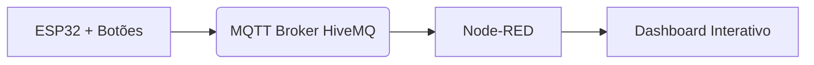

# 🏟️ Projeto IoT – Monitoramento de Partida de Futebol  

# Arquivo codigos fonte 
[projeto-iot-futebol.zip](https://github.com/user-attachments/files/22373119/projeto-iot-futebol.zip)


## 👤 Integrantes  
- **Guilherme Lima**
- **Guilherme de Paula**
- **Enzo de Faria**
- **Matheus Gomes**
  


---

## 📖 Descrição do Projeto  
Este projeto demonstra a aplicação da **Internet das Coisas (IoT)** no contexto esportivo.  
O sistema coleta e transmite em tempo real os principais eventos de uma partida de futebol (gols, cartões amarelos e cartões vermelhos), utilizando um **ESP32** conectado a botões físicos.  

Os dados são enviados via protocolo **MQTT** para o broker público da **HiveMQ** e processados no **Node-RED**, que gera dashboards interativos para visualização do placar e estatísticas do jogo.  

✨ **Diferenciais do Projeto**:  
- 📡 Monitoramento em tempo real dos eventos da partida.  
- ⚡ Automação na transmissão de dados sem necessidade de registro manual.  
- 📊 Visualização centralizada em dashboards interativos.  
- 🔗 Arquitetura escalável e adaptável a outros cenários esportivos.  

---

## 🛠️ Arquitetura Proposta  

A arquitetura é composta por quatro camadas principais:  

1. **Dispositivo IoT**: ESP32 conectado a quatro botões físicos, responsáveis por enviar os eventos da partida.  
   - ⚽ Gol Time A  
   - ⚽ Gol Time B  
   - 🟨 Cartão Amarelo  
   - 🟥 Cartão Vermelho  

2. **Comunicação**: protocolo **MQTT**, enviando mensagens para o broker público **HiveMQ**.  

3. **Plataforma de Gerenciamento**: **Node-RED** configurado para receber os tópicos MQTT, processar os eventos e atualizar variáveis de fluxo.  

4. **Dashboard**: visualização em tempo real com indicadores para placar dos times e cartões, além de alertas de eventos.  

### 📊 Diagrama da Arquitetura  


---

## ⚙️ Recursos Necessários  

### 🔧 Hardware  
- ESP32  
- 4 Botões físicos  

### 💻 Software/Plataformas  
- [Wokwi](https://wokwi.com/) – Simulação do ESP32  
- [Node-RED](https://nodered.org/) – Plataforma de gerenciamento IoT  
- [HiveMQ Broker Público](https://www.hivemq.com/public-mqtt-broker/) – Broker MQTT  
- Protocolos **MQTT** e **HTTP**  

---

## 🚀 Instruções de Uso  

### 1️⃣ Configuração do ESP32  
- Configure o código do ESP32 com os pinos dos botões e conexão ao broker HiveMQ.  

- Faça upload do código (fornecido na pasta `src/esp32`).  

### 2️⃣ Configuração do Node-RED  
- Importe o fluxo em JSON fornecido na pasta `flows/`.  
- Configure o broker MQTT (`broker.hivemq.com`) na porta **1883**.  

### 3️⃣ Execução  
- Aperte os botões no ESP32 (ou na simulação Wokwi).  
- Observe os dados chegando ao Node-RED.  
- Acesse o **Dashboard** para visualizar:  
  - ⚽ Placar do Time A e Time B  
  - 🟨 Contagem de cartões amarelos  
  - 🟥 Contagem de cartões vermelhos  
  - 🔔 Alertas de evento em tempo real  

---

## 💻 Códigos-Fonte  

📂 Estrutura de arquivos do projeto:  
```bash
.
├── README.md                # Documentação do projeto
├── src
│   └── esp32_code.ino       # Código do ESP32 para publicação MQTT
├── flows
│   └── node_red_flow.json   # Fluxo Node-RED para processamento e dashboard
```

- **ESP32 (Wokwi)**: código em C++ para captura dos eventos e publicação MQTT.  
- **Node-RED**: fluxo em JSON para processamento, contagem de eventos e dashboard interativo.  

---

## 📌 Possíveis Expansões Futuras  
- Integração com banco de dados para histórico das partidas.  
- Geração de relatórios estatísticos automáticos.  
- Visualização em aplicativos móveis.  
- Integração com APIs esportivas para enriquecer os dados.  

---

## 🏁 Conclusão  
Este projeto exemplifica o potencial da **IoT aplicada ao esporte**, mostrando como dados simples podem ser **coletados, transmitidos e visualizados em tempo real**.  
A arquitetura proposta é **flexível, escalável e aplicável** a diferentes cenários além do futebol, como monitoramento de treinos, análise de desempenho ou gestão de arenas inteligentes.  

---

🔗 Desenvolvido por: 
**Guilherme Lima - RM566045**
**Guilherme de Paula - RM562471**
**Enzo de Faria - RM562448**
**Matheus Gomes - RM562277** 
